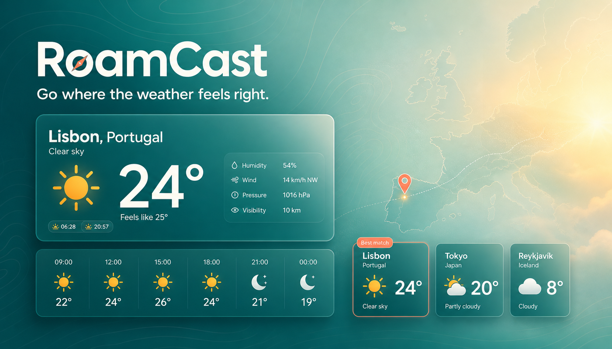

# RoamCast

RoamCast is a weather app for planning trips. It brings forecasts, maps,
destination comparisons, and saved places together so you can check more than
just the current temperature.

[Open RoamCast](https://roamcast-ten.vercel.app)

## Features

- Search for places around the world
- Current weather, hourly conditions, and a 10-day forecast
- Personalized destination recommendations for live forecast dates
- Side-by-side comparison for up to three destinations
- Trip Scores based on your weather preferences
- Three-hour activity windows and weather-ready packing suggestions
- Shareable trip briefs that do not require an account
- Interactive destination maps
- Saved places, recent searches, and trip plans
- Metric and imperial units
- Weather-based travel notes for heat, rain, wind, freezing conditions, and
  thunderstorms

Saved information stays in the browser, so the app does not need an account.
Location access is only requested when the location button is used.

## Built with

- Next.js
- React and TypeScript
- Tailwind CSS
- Open-Meteo
- MapLibre GL JS and OpenFreeMap
- Vercel

## Notes

Forecasts are limited to the dates available from the weather provider. Trips
outside that window can still be saved, but the forecast will appear when the
date gets closer.

The travel notes in RoamCast are for planning only. They are not official
weather or emergency warnings.

Weather and place data come from [Open-Meteo](https://open-meteo.com/). Maps
are rendered with [MapLibre GL JS](https://maplibre.org/) using
[OpenFreeMap](https://openfreemap.org/) tiles.
