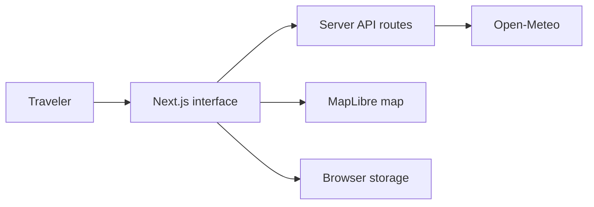

# RoamCast

### Travel weather, made clearer

RoamCast is a full-stack weather project that helps travelers compare
destinations, understand upcoming conditions, and plan trips with more
confidence.

**[View the live project →](https://roamcast-ten.vercel.app)**

## Overview

RoamCast turns live weather data into a focused planning experience for
travelers. Instead of presenting a generic weather dashboard, the application
is organized around a practical question:

> Where should I go, and what will the weather mean for my plans?

The result combines global search, detailed forecasts, destination comparison,
interactive maps, saved trips, and practical travel guidance in one responsive
application.

## Key features

- Search for cities, regions, and postcodes around the world
- View current conditions, the next 12 hours, and a 10-day forecast
- Compare weather for up to three destinations
- Explore destination locations on an interactive map
- Save favorite places, recent searches, and trip plans on the device
- Switch between metric and imperial units
- Use browser location only after choosing to share it
- See planning guidance for extreme heat, strong wind, heavy rain, freezing
  temperatures, and thunderstorms
- Navigate comfortably on mobile, tablet, and desktop

## Project walkthrough

| Experience | Purpose |
| --- | --- |
| **Forecast** | Search and review current, hourly, and 10-day weather |
| **Destination** | Explore detailed conditions, a map, and travel guidance |
| **Compare** | Evaluate up to three destinations over the same date range |
| **Saved** | Revisit favorites, recent searches, and locally stored trips |

## How it works

The interface never talks directly to the forecast provider. Next.js route
handlers validate requests, call Open-Meteo, normalize the response, and return
consistent data to the browser. Personal choices such as favorites and unit
preferences stay in versioned local storage.

## Tech stack

| Area | Technology |
| --- | --- |
| Framework | Next.js 16 |
| Interface | React 19 and TypeScript |
| Styling | Tailwind CSS and custom responsive CSS |
| Weather data | Open-Meteo forecast and geocoding APIs |
| Maps | MapLibre GL JS and OpenFreeMap |
| Hosting | Vercel |
| Testing | Node.js test runner and production route checks |

## Design decisions

- **Travel first:** The opening screen shows the destination, temperature,
  condition, high and low, and upcoming hours immediately.
- **No account required:** Saved places and trips remain on the current device.
- **Guidance, not alarms:** Weather risks are clearly presented as planning
  guidance rather than official emergency warnings.
- **Privacy by default:** Location access starts only after a user action.
- **Provider flexibility:** Forecast data is normalized behind server routes so
  the interface is not tied to one provider response format.
- **Accessible interaction:** Controls support keyboard navigation, readable
  contrast, reduced motion, and comfortable touch targets.

## Challenges

### Comparing different time zones

Forecast dates must represent each destination's local time. The app preserves
provider time-zone information and aligns daily results to a common comparison
range.

### Keeping search results usable

The destination list needs to remain clickable even when it overlaps the
forecast hero. Explicit stacking layers keep the autocomplete panel above the
weather content.

### Handling unavailable data

External services can fail or return missing fields. RoamCast validates inputs,
uses typed API errors, briefly caches normalized forecasts, and shows clear
retry or unavailable states instead of inventing weather data.

## Current limitations

- Saved data does not synchronize between devices
- There are no accounts or notifications
- Trips beyond the forecast window can be saved but cannot show live weather
- Historical climate comparisons and radar layers are not included
- Travel guidance is informational and is not an official warning service

## Future improvements

- Optional accounts and cross-device synchronization
- Weather notifications for saved trips
- Historical climate comparisons
- Additional map layers from an eligible weather-tile provider
- Broader automated accessibility and browser testing

## Data and attribution

Weather and geocoding data are provided by
[Open-Meteo](https://open-meteo.com/). Maps are rendered with
[MapLibre GL JS](https://maplibre.org/) using
[OpenFreeMap](https://openfreemap.org/) tiles.

This project uses the public Open-Meteo service for eligible non-commercial
usage. Provider attribution, traffic limits, and commercial terms should be
reviewed before operating the application commercially.
